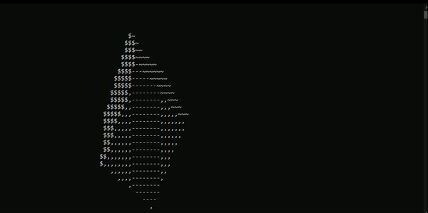

# ShapeRendering


<br> *You can use left/right arrow keys to move between shapes! Neat, huh?*

## Build Instructions

1. Ensure you have the following installed:
   - Either [GCC](https://gcc.gnu.org/install/download.html) (version 10 or later) or [Clang](https://releases.llvm.org/download.html) (version 10 or later). 
   > **Note:** Windows users might prefer to use Microsoft's build tools.
   - [CMake](https://cmake.org/download/): version 3.12 or later
2. Clone this repository and enter it:
   ```bash
   git clone https://github.com/Zachary-Harrison/ShapeRendering.git && cd ShapeRendering/
   ```
3. Create a build directory and enter it:
   ```bash
   mkdir build && cd build
   ```
   > **Note:** you can replace `build` with a different name if so desired.
4. Compile the project using `cmake`:
   ```bash
   cmake ..
   ```
5. Build the project using `make`. On Windows, you might need to use `nmake` or `msbuild`, depending on your setup:
   ```bash
   make
   ```
6. Run the program! On Windows, you might need to add `.exe` to the end of the executable name:
   ```bash
   ./ShapeRendering
   ```
   And if you want to run the unit tests:
   ```bash
   ./UnitTestRunner
   ```

## Similar Projects

- [cube.c](https://github.com/servetgulnaroglu/cube.c) by [servetgulnaroglu](https://github.com/servetgulnaroglu). This was coded live, which can be seen [here on youtube](https://youtu.be/p09i_hoFdd0).
- [Donut Mark II](https://www.a1k0n.net/2011/07/20/donut-math.html) by Andy Sloane. 
